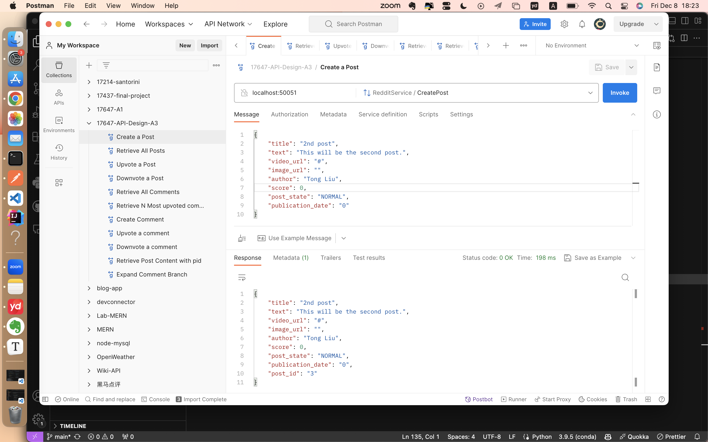
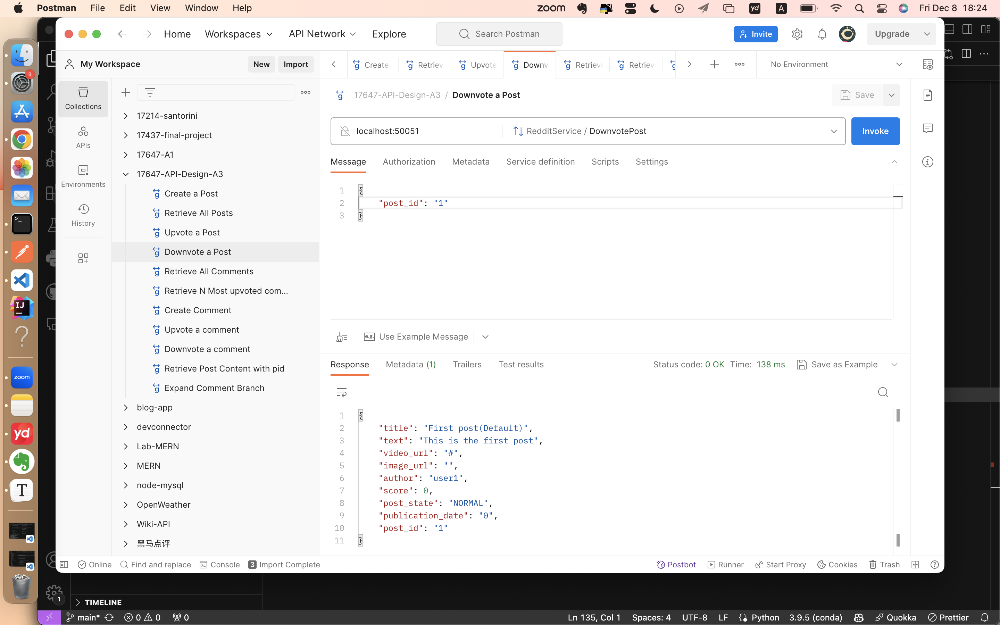
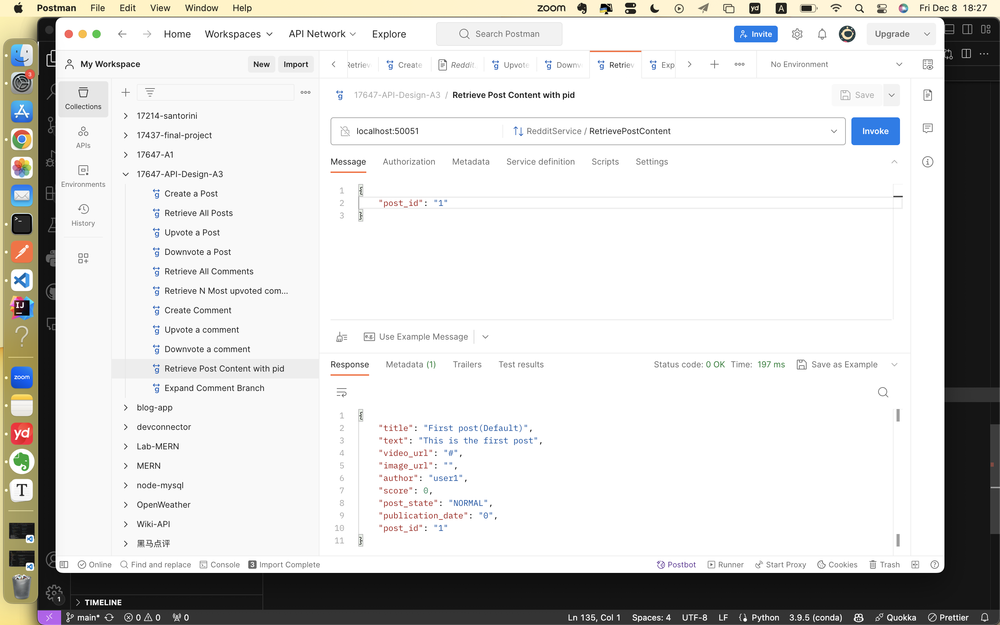
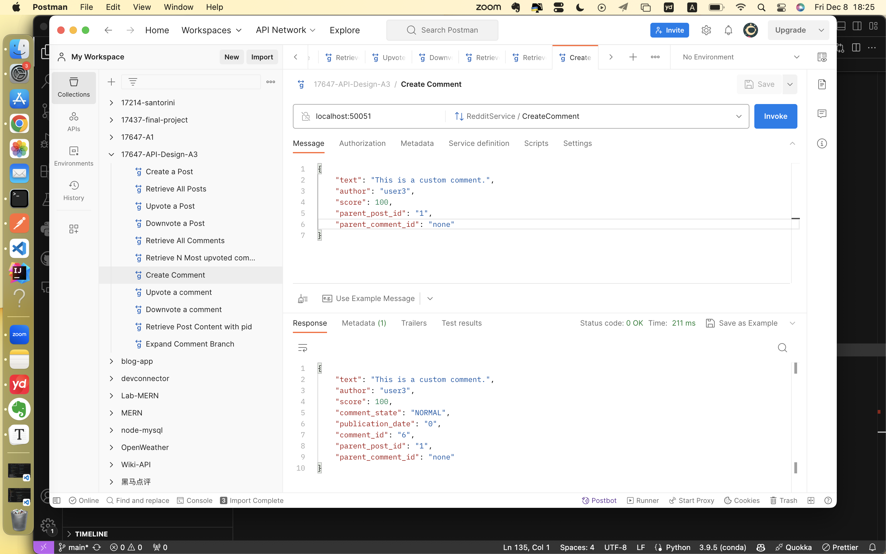
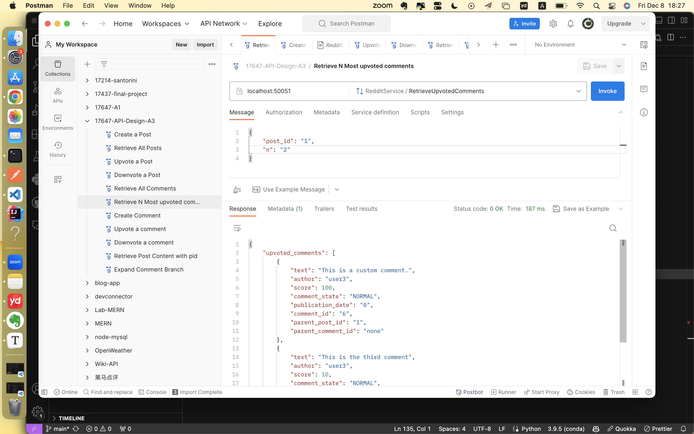
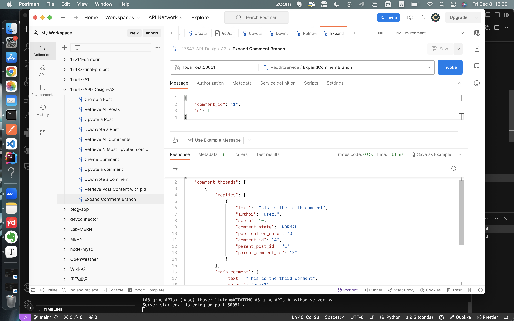

# 17625-A3-gRPC

Name: Tong Liu

AndrewID: tl3

Assignment: A3-gRPC		

Language:Python

github-link:https://github.com/tongliu1234/17625-A3-gRPC


#### 1. Protocol Buffer definitions

1. User 

   ```protobuf
   message User {
     string user_id = 1;
   }
   ```

   

2. Post

   ```protobuf
   message Post {
     string title = 1;
     string text = 2;
     string video_url = 3;
     string image_url = 4;
     string author = 5;
     int32 score = 6;
     enum State {
       NORMAL = 0;
       LOCKED = 1;
       HIDDEN = 2;
     }
     State post_state = 7;
     int64 publication_date = 8;
     string post_id = 9;
   }
   ```

   

3. Comment

   ```protobuf
   message Comment {
     string text = 1;
     string author = 2;
     int32 score = 3;
     enum State {
       NORMAL = 0;
       HIDDEN = 1;
     }
     State comment_state = 4;
     int64 publication_date = 5;
     string comment_id = 6;
     string parent_post_id = 7;
     st
   ```

   

4. **Subreddit**(Extra Credit)

   ```protobuf
   message Subreddit {
     string name = 1;
     enum Visibility {
       PUBLIC = 0;
       PRIVATE = 1;
       HIDDEN = 2;
     }
     Visibility visibility = 2;
     repeated string tags = 3;
   }
   ```

   

5. Reddit

```protobuf
message PostRequest {
  string post_id = 1;
}

message PostResponse {
  repeated Post posts = 1;
}

message CommentRequest {
  string comment_id = 1;
}

message CommentResponse {
  repeated Comment comments = 1;
}

message PostRequest2 {
  string post_id = 1;
  string n = 2;
}

message UpvotedCommentsResponse {
  repeated Comment upvoted_comments = 1;
}

message CommentBranchRequest {
  string comment_id = 1;
  int32 n = 2;
}

message CommentBranchResponse {
  repeated CommentThread comment_threads = 1;

  message CommentThread {
    Comment main_comment = 1;
    repeated Comment replies = 2;
  }
}

message UpdatesRequest {
  string post_id = 1;
  repeated string comment_ids = 2;
}

message UpdatesResponse {
  int32 post_score = 1;
  repeated CommentUpdate comment_updates = 2;

  message CommentUpdate {
    string comment_id = 1;
    int32 score = 2;
  }
}
```


#### 2. Service definitions

```protobuf
service RedditService {
  rpc CreatePost(Post) returns (Post);
  rpc UpvotePost(PostRequest) returns (Post);
  rpc DownvotePost(PostRequest) returns (Post);
  rpc RetrieveAllPosts(PostRequest) returns (PostResponse);
  rpc RetrievePostContent(PostRequest) returns (Post);
  rpc CreateComment(Comment) returns (Comment);
  rpc UpvoteComment(CommentRequest) returns (Comment);
  rpc DownvoteComment(CommentRequest) returns (Comment);
  rpc RetrieveAllComments(PostRequest) returns (CommentResponse);
  rpc RetrieveUpvotedComments(PostRequest2) returns (UpvotedCommentsResponse);
  rpc ExpandCommentBranch(CommentBranchRequest) returns (CommentBranchResponse);
  
  // Extra Credit
  rpc MonitorUpdates(UpdatesRequest) returns (stream UpdatesResponse);
}
```


#### 3.Storage backend 

A straightforward in-memory storage approach is employed as the backend for storing entities such as posts, comments, users, and potentially subreddits. The in-memory storage is designed to be simple and suitable for test purposes, as specified in the assignment. Entities are stored within Python dictionaries, where each entity type corresponds to a separate dictionary. This choice facilitates rapid development and testing, as it allows for quick retrieval and manipulation of data during API service interactions. 


#### 4.Links 

Server: https://github.com/tongliu1234/17625-A3-gRPC/blob/main/server.py

Client: https://github.com/tongliu1234/17625-A3-gRPC/blob/main/client.py

Mock_object: https://github.com/tongliu1234/17625-A3-gRPC/blob/main/mock_object.py

Test_high_level_func: https://github.com/tongliu1234/17625-A3-gRPC/blob/main/test_high_level_func.py

Proto: https://github.com/tongliu1234/17625-A3-gRPC/blob/main/Reddit.proto

Backend-storage:https://github.com/tongliu1234/17625-A3-gRPC/blob/main/dummy_data.py


#### 5. Extra Credit

1. Data Model(5pts)

   Subreddit - note that this portion will require changing other PBs (Post, at the very least)
   ○ Subreddits have a human-readable name
   ○ Posts belong to exactly one subreddit
   ○ Subreddits can be public, private, or hidden
   ○ Subreddits can define a set of tags that are attached to posts

   ```protobuf
   message Subreddit {
     string name = 1;
     enum Visibility {
       PUBLIC = 0;
       PRIVATE = 1;
       HIDDEN = 2;
     }
     Visibility visibility = 2;
     repeated string tags = 3;
   }
   ```

   

2. Service Design(5pts)

   Monitor updates - client initiates the call with a post, with ability to add comment IDs later in a stream.
   The server returns a stream of score updates for the post and the comments.

   ```protobuf
   service RedditService {
     ...
     
     // Extra Credit
     rpc MonitorUpdates(UpdatesRequest) returns (stream UpdatesResponse);
   }
   ```

   

3. Implementation

   ● Implement the server portion of the extra credit API above (5pts)

   Server: https://github.com/tongliu1234/17625-A3-gRPC/blob/main/server.py

   ```python
   class RedditServicer(RedditServiceServicer):
     # ... Other API
   
     def MonitorUpdates(self, request, context):
           post_id = request.post_id
           comment_ids = request.comment_ids
           while True:
               time.sleep(1)
               post_score = posts[post_id].score if post_id in posts else 0
               comment_updates = [
                   {"comment_id": comment_id, "score": comments[comment_id].score}
                   for comment_id in comment_ids
                   if comment_id in comments
               ]
               yield UpdatesResponse(
                   post_score=post_score, comment_updates=comment_updates
               )
   ```

   

   ● Implement the client portion of the extra credit API above (5pts).

   Client: https://github.com/tongliu1234/17625-A3-gRPC/blob/main/client.py

   ```python
   class RedditApiClient:
       def __init__(self, server_address):
           self.channel = grpc.insecure_channel(server_address)
           self.stub = RedditServiceStub(self.channel)
           
       #... Other API
       
       def monitor_updates(self, updates_request):
           return self.stub.MonitorUpdates(updates_request)
   
       def close(self):
           self.channel.close()
   
   ```

   

4. Testing(5pts)

   use Postman to call your API (1pt per API), take a screenshot of the response

   

   ● Create a Post.

   

   

   ● Upvote or downvote a Post

   

   

   

   ● Retrieve Post content

   

   

   ● Create a Comment

   

   

   ● Upvote or downvote a Comment

   

   

   

   ● Retrieving a list of N most upvoted comments under a post, where N is a parameter to the call. The
   returned result should indicate whether there are replies under those comments.

   

   

   ● Expand a comment branch. This allows to open most N most upvoted comments under a given
   comment, alongside with N most upvoted comments under those comments. Essentially, a tree of depth 2.

   


5.Commands

```
python -m grpc_tools.protoc -I. --python_out=. --grpc_python_out=. Reddit.proto

python server.py

python client.py
```


